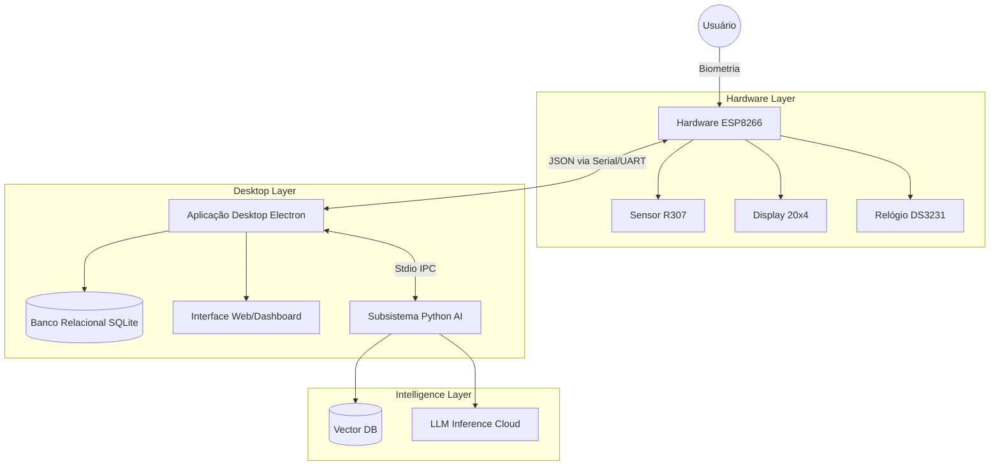

# VERITAS: Sistema Integrado de Controle Biométrico e Assistência Jurídica Inteligente

**Autor:** Geovanni Honorato  
**Data da Análise:** 28 de Janeiro de 2026  
**Versão do Sistema:** 2.0

---

## Resumo Executivo

O projeto **Veritas** representa uma solução de ponta a ponta (end-to-end) para o gerenciamento de presença e assistência operacional no Núcleo de Prática Jurídica (NPJ). Diferenciando-se de relógios de ponto tradicionais, o Veritas implementa uma arquitetura híbrida *IoT-Desktop-AI*, combinando hardware proprietário de baixo custo, uma aplicação desktop robusta para gestão administrativa e um subsistema de Inteligência Artificial generativa (RAG) para suporte operacional. Este documento detalha a engenharia do sistema, dissecando suas camadas de hardware, comunicação serial, persistência de dados e a arquitetura de agentes autônomos que compõem sua "inteligência".

---

## 1. Introdução

### 1.1 Contexto e Justificativa
O controle de frequência em ambientes acadêmicos e de estágio, como um Núcleo de Prática Jurídica, exige precisão e confiabilidade. Métodos tradicionais (papel, planilhas) são suscetíveis a fraudes e erros. Além disso, a gestão desses ambientes envolve uma carga cognitiva alta para coordenadores, que precisam responder constantemente a dúvidas sobre prazos, regras e vínculos entre estagiários e assistidos. O Veritas nasce para automatizar o controle de acesso e, simultaneamente, atuar como um oráculo de conhecimento para a instituição.

### 1.2 Objetivos
1.  **Autenticação Biométrica Robusta**: Eliminar fraudes de identidade no registro de ponto.
2.  **Gestão Centralizada**: Prover um dashboard administrativo para controle de turnos, faltas e relatórios.
3.  **Assistência Inteligente**: Integrar um modelo de linguagem (LLM) capaz de consultar documentos internos (Regimentos, Prazos) e bases de dados operacionais (Vínculos Aluno-Assistido) para responder dúvidas em linguagem natural.

---

## 2. Arquitetura do Sistema

O sistema opera sobre uma arquitetura de três camadas principais, comunicando-se via protocolos assíncronos.

### 2.1 Diagrama de Componentes (Conceitual)

---

## 3. Engenharia de Hardware (Firmware & Eletrônica)

O núcleo físico do Veritas é um dispositivo IoT desenhado para operar de forma transparente ('invisible computing').

### 3.1 Especificações do Microcontrolador (MCU)
O sistema é orquestrado pelo **Espressif ESP8266 (NodeMCU v3)**, um SoC Wi-Fi de 32-bits que opera a 80MHz (overclockável para 160MHz).
*   **Tensão de Operação**: 3.3V (Lógica).
*   **Conectividade**: Wi-Fi 802.11 b/g/n (stack TCP/IP completo).
*   **Pinout Utilizado**:
    *   **D1 (GPIO 5) / D2 (GPIO 4)**: Barramento I2C (SCL/SDA) para o Display e RTC.
    *   **D7 (GPIO 13) / D8 (GPIO 15)**: SoftwareSerial RX/TX para comunicação com o Sensor Biométrico (emulando UART secundária).

> **📸 [Espaço para Print PDF: Pinout do ESP8266]**
> *Legenda: Diagrama de pinos do NodeMCU utilizado na montagem.*

### 3.2 Sensor Biométrico Óptico (R307/R305)
O componente crítico do sistema é o módulo de leitura de impressões digitais R307. Este sensor não é apenas uma "câmera", mas um computador completo dedicado ao processamento de imagens (DSP).

**Métricas de Desempenho (Datasheet):**
*   **Taxa de Aceitação Falsa (FAR):** < 0.001%
*   **Taxa de Rejeição Falsa (FRR):** < 0.1%
*   **Tempo de Reconhecimento:** < 0.5 segundos

#### Ciclo de Funcionamento
O processo de identificação ocorre em quatro etapas fundamentais:
1.  **Captura da Imagem**: Quando um dedo é posicionado sobre o sensor óptico, ele captura uma imagem digital da impressão digital em alta resolução.
2.  **Processamento**: O processador interno converte a imagem em um *template* digital único (conjunto de minúcias).
3.  **Armazenamento/Comparação**: Durante o cadastro, o template é armazenado com um ID; na verificação, é comparado com o banco (Match 1:N).
4.  **Resultado**: O sensor retorna o ID correspondente se houver match positivo.

#### Fundamentação Teórica (FTIR)
O sensor utiliza a técnica de **Reflexão Interna Total Frustrada (FTIR)**.
1.  **Iluminação**: Um array de LEDs de alta luminosidade (Verde/Azul) ilumina o prisma de vidro por baixo.
2.  **Refração**: Quando o dedo toca o prisma, as cristas (parte alta da digital) tocam o vidro, "frustrando" a reflexão da luz e absorvendo-a.
3.  **Captura**: Os vales (parte baixa) não tocam o vidro, permitindo que a luz reflita internamente e atinja o sensor de imagem CMOS.
4.  **Resultado**: Gera-se uma imagem de alto contraste onde as cristas são escuras e os vales são brilhantes.

#### Pipeline de Processamento Interno (DSP)
O DSP (Processador Digital de Sinal) interno do módulo executa:
1.  **Binarização**: Converte a imagem analógica para preto e branco.
2.  **Desbaste (Thinning)**: Reduz as linhas das cristas a 1 pixel de largura.
3.  **Extração de Minúcias**: Identifica bifurcações, terminações e ilhas.
4.  **Template Matching**: Compara o mapa de minúcias atual com o banco de dados interno (1:N) em <1.0s.

> **📸 [Espaço para Print PDF: Diagrama Esquemático/Circuito]**
> *Legenda: Fluxo de conexão entre o Sensor, MCU e Alimentação.*

### 3.3 Periféricos Auxiliares
*   **Display LCD 20x4 (I2C)**: Interface visual primária. Utiliza o controlador HD44780 com um backpack I2C (PCF8574) para reduzir o uso de pinos de 16 para apenas 2 (SDA/SCL).
*   **RTC DS3231**: Módulo de Relógio de Tempo Real de alta precisão (TCXO - Temperature Compensated Crystal Oscillator). Possui bateria CR2032 própria, mantendo a hora correta mesmo se o dispositivo for desligado da energia ou USB por anos.

> **📸 [Espaço para Print PDF: Foto do Protótipo Montado]**
> *Legenda: Visão interna da montagem dos componentes.*

> **📸 [Espaço para Print PDF: Modelo 3D da Case]**
> *Legenda: Renderização da caixa impressa em 3D.*

### 3.2 Lógica do Firmware (C++)
O firmware, desenvolvido em C++ sobre o Framework Arduino (PlatformIO), implementa uma **Máquina de Estados Finita (FSM)** para gerenciar o fluxo de operação:

1.  **IDLE**: O sistema exibe o relógio e aguarda interação (toque no sensor ou comando serial).
2.  **VERIFYING**: Ao detectar um dedo, captura a imagem, converte para template e busca no banco interno do R307.
3.  **AWAITING_RESPONSE**: Se a digital é reconhecida, envia o ID via Serial para o Desktop e aguarda dados do usuário (Nome, Mensagem) para exibição.
4.  **ENROLLMENT**: Estado especial bloqueante para cadastro de novas digitais (fluxo de 2 capturas para confirmação).

#### Protocolo de Comunicação (Veritas JSON Protocol)
A comunicação Hardware-Desktop não é meramente um stream de bytes, mas um protocolo estruturado baseado em JSON, garantindo extensibilidade e facilidade de debug.

*   **Hardware -> Desktop**:
    *   `{"status": "activity", "id": 12, "timestamp": "..."}`: Registro de ponto.
    *   `{"status": "error", "message": "..."}`: Diagnósticos.
*   **Desktop -> Hardware**:
    *   `{"command": "GET_USER_DATA", "id": 12}`: Solicitação de metadados.
    *   `{"command": "USER_DATA_RESPONSE", "nome": "...", "type": "Entrada"}`: Dados para exibição no LCD.

---

## 4. Engenharia de Software (Desktop & Backend)

A aplicação principal atua como o cérebro do sistema, orquestrando a persistência de dados, a interface do usuário e a inteligência artificial.

### 4.1 Stack Tecnológico
*   **Runtime**: Node.js (com suporte híbrido para execução via Electron ou Standalone Server).
*   **Interface**: HTML5, Vanilla JavaScript (componentização via DOM manipulation), Tailwind CSS.
*   **Database**: `better-sqlite3` (SQLite) para dados relacionais.
*   **Comunicação Externa**: `express` (API Server), `socket.io` (Real-time events), `serialport` (Hardware driver).

### 4.2 Modelagem de Dados (SQLite)
O esquema relacional é normalizado para garantir integridade:

*   **`users`**: Armazena dados cadastrais (Matrícula, Nome, Turma, Turno, Gênero, Dias da Semana). O campo `diasSemana` é armazenado como JSON string, permitindo flexibilidade na grade horária.
*   **`activities`**: Log imutável de eventos (Entrada/Saída). A inserção dispara gatilhos de aplicação (Emails, WebSockets).
*   **`faltas`**: Tabela calculada. Um processo diário (`initializeTodaysFaltas`) gera registros de falta para todos os alunos esperados no dia. Quando o aluno registra presença, o sistema remove a falta correspondente automaticamente.
*   **`settings`**: Key-Value store para configurações (Portas seriais, API Keys, Tokens OAuth).

### 4.3 Algoritmos Críticos
*   **Inferência de Turno**: O sistema possui um algoritmo heurístico (`inferAndPopulateUserTurnos`) que analisa as últimas 50 atividades de um usuário para determinar se ele é "Matutino" ou "Vespertino" baseada na moda estatística dos horários de entrada, corrigindo inconsistências históricas automaticamente.
*   **Sincronização de Estado**: Utiliza WebSockets (`socket.io`) para que múltiplos clientes (janelas Electron ou navegadores na rede) vejam o status do leitor biométrico e as tabelas de presença em tempo real, sem necessidade de *polling*.

### 4.4 Sistema de Notificação e Comprovante de Ponto (EmailService)
Uma funcionalidade crítica para a segurança jurídica e acadêmica dos estagiários é o envio automático de comprovantes de presença. O `EmailService.js` implementa um subsistema de mensageria robusto que opera de forma assíncrona ao registro biométrico.

*   **Protocolos Suportados**: 
    *   **OAuth2 (Google Gmail Principal)**: Implementação moderna utilizando tokens de acesso e refresh tokens, permitindo o envio seguro através de contas institucionais Google sem expor senhas simples.
    *   **SMTP Legacy**: Fallback para servidores de e-mail tradicionais, garantindo compatibilidade universal.
*   **Design do Comprovante**: Os e-mails não são meros textos; o sistema gera templates HTML responsivos (`_generateHtmlTemplate`) com design "Dark Mode" premium, alinhado à identidade visual do software. O comprovante inclui:
    *   Timestamp preciso (Data e Hora) e Tipo de Registro (Entrada/Saída).
    *   Dados do Aluno (Nome, Matrícula).
    *   Identificador visual "cid" (Content-ID) para exibição segura da logomarca institucional.
    > **📸 [Espaço para Print: Modelo de Email Recebido]**
    > *Recomendação: Print de um e-mail real recebido no Gmail/Outlook.*
*   **Fluxo de Automação**: Ao detectar um registro válido na `activities`, o sistema enfileira o disparo do e-mail imediatamente. O envio é tratado como uma *Promise* secundária ("fire-and-forget" do ponto de vista do bloqueio de UI, mas com log de auditoria no servidor), garantindo que a percepção de latência do usuário no leitor biométrico não seja afetada pelo tempo de resposta do servidor SMTP.

---

## 5. O Subsistema de Inteligência Artificial (Veritas AI)

Talvez a parte mais inovadora do projeto, o Veritas incorpora um agente autônomo baseado em LLMs para atuar como assistente operacional.

### 5.1 Arquitetura RAG (Retrieval-Augmented Generation)
Para superar as limitações de conhecimento dos LLMs genéricos, o Veritas implementa um pipeline RAG local:

1.  **Ingestão**: Documentos (PDFs do NPJ) são processados por um script Python híbrido (`extract_text`), que utiliza `PyPDF` para arquivos simples e `Docling` (com OCR e reconhecimento de tabelas) para documentos complexos.
2.  **Vetorização**: Os textos são fragmentados (Chunking) e convertidos em vetores densos (Embeddings) utilizando o modelo `all-MiniLM-L6-v2`.
3.  **Armazenamento**: Os vetores são indexados no **LanceDB**, um banco de dados vetorial embedded de alta performance, isento de dependências de servidor externo.

### 5.2 O Processamento em Camadas
A busca de informação ocorre em um fluxo sofisticado:
1.  **Node.js (AIService)**: Recebe a pergunta do usuário.
2.  **LangChain (Agente)**: O modelo decide qual ferramenta usar baseada na intenção:
    *   `search_students`: Consulta SQL direta para dados cadastrais.
    *   `check_attendance`: Analisa as tabelas de `activities` e `faltas`.
    *   `search_knowledge_base`: Invoca o subsistema Python para buscar nas normas do NPJ.
    *   `search_assisted_relationship`: Busca em planilhas Excel (memória de trabalho) para encontrar vínculos entre Estagiários e Pacientes.
3.  **Python Subsystem**: Um processo Python persistente (`rag_manager.py`) roda em background, mantendo o modelo de embedding e a conexão com o LanceDB na memória RAM para garantir respostas com latência de milissegundos (<200ms típica).

### 5.3 Integração com LLM
O sistema utiliza a API da Groq para inferência de alta velocidade, utilizando modelos open-source (como `llama3` ou similares, configurados como `openai/gpt-oss-20b` no código), permitindo que o assistente analise contextos complexos e gere respostas naturais em português.

### 5.4 Dinâmica de Aprendizado Contínuo
Diferente de sistemas estáticos, o Veritas foi projetado para "aprender" novos regimentos e procedimentos organizacionais sem reescrita de código.

*   **Hot-Folder `kp_source`**: O sistema monitora (via injeção no boot) a pasta `kp_source`. O usuário final (Coordenador) pode simplesmente arrastar novos arquivos PDF para esta pasta.
    > **📸 [Espaço para Print: Pasta de Origem (kp_source) com PDFs]**
    > *Recomendação: Print do Windows Explorer mostrando a pasta com alguns arquivos PDF dentro.*
*   **Ingestão Transparente**: Ao reiniciar o serviço ou acionar o comando de reindexação, o script `rag_ingest.py` processa automaticamente esses novos arquivos, atualizando o banco vetorial `knowledge.lance`. Isso democratiza a manutenção da base de conhecimento, removendo a dependência do desenvolvedor para atualizações de conteúdo.

---

## 6. Análise Detalhada da Aplicação Web (Frontend Deep-Dive)

A interface do Veritas não é apenas uma camada visual, mas uma Aplicação de Página Única (SPA) complexa que orquestra todo o controle operacional. Abaixo, detalhamos cada módulo funcional encontrado na análise do código-fonte (`index.html`, `script.js`).

### 6.1 Dashboard e Visão Geral (Torre de Controle)
O painel inicial foi projetado para fornecer consciência situacional imediata ao coordenador.

> **📸 [Espaço para Print: Dashboard Principal]**
> *Recomendação: Capture a tela inicial mostrando os Cards de KPI e os Gráficos.*

*   **KPIs em Tempo Real**: Três cartões flutuantes exibem métricas vitais:
    *   **Presença Hoje**: Contador atualizado via WebSocket a cada entrada.
    *   **Ausentes Hoje**: Cálculo diferença entre *Base Total* vs *Registros*.
    *   **Total de Alunos**: Número de registros ativos no banco SQLite.
*   **Visualização de Dados (Data Viz)**:
    *   *Gráfico de Tendência (Line Chart)*: Monitora a assiduidade nos últimos 7 dias.
    *   *Gráfico de Composição (Doughnut)*: Mostra a proporção Presentes/Ausentes do dia corrente.
*   **Barra de Pesquisa IA**: Um componente central (`#ai-search-box`) permite que o usuário digite perguntas em linguagem natural sem sair da tela principal.

### 6.2 Módulo de Gestão de Frequência
Esta seção é o "livro de ponto digital", permitindo auditoria e correção de dados.

> **📸 [Espaço para Print: Tabela de Atividades/Faltas]**
> *Recomendação: Capture a tabela com algum filtro (Turma ou Turno) aplicado.*

*   **Abas de Navegação**: O sistema alterna entre "Atividades" (Fluxo de Entradas/Saídas) e "Faltas" (Lista de Ausências).
*   **Filtros Avançados**:
    *   Controles customizados (`.custom-dropdown`) permitem filtrar por **Turma**, **Turno**, **Mês/Ano** e **Nome**.
    *   A busca é reativa: a tabela atualiza instantaneamente enquanto o usuário digita.
*   **Ferramentas de Exportação**: O botão "Exportar Relatório" aciona o endpoint `/api/export/report`, gerando um arquivo Excel (.xlsx) complexo com abas separadas por turma.
*   **Registro Manual**: Um botão de ação "Nova Frequência" abre um modal para lançar presenças manualmente em casos de falha biométrica ou esquecimento.
    > **📸 [Espaço para Print: Modal de Nova Frequência]**
    > *Recomendação: Print do modal de registro manual aberto.*

### 6.3 Gestão de Usuários e Cadastros
O módulo de administração de pessoas (`#usuarios-section`) permite o controle total da base de alunos.

> **📸 [Espaço para Print: Modal de Cadastro de Aluno]**
> *Recomendação: Abra o modal de "Adicionar Aluno" mostrando o seletor de dias da semana.*

*   **Tabela de Alunos**: Exibe matrícula, turma, turno e dias de aula. Inclui "Badges" visuais para indicar status.
*   **Modal de Cadastro Inteligente**:
    *   *Seletor de Dias da Semana*: Uma interface de botões (Seg, Ter, Qua...) permite definir a grade horária do aluno. O sistema usa isso para calcular faltas automaticamente apenas nos dias devidos.
    *   *Validação*: Impede cadastro de matrículas duplicadas.
    > **📸 [Espaço para Print: Menu de Ações (Sincronizar/Remover Duplicados)]**
    > *Recomendação: Print com o dropdown de ações do usuário aberto.*

### 6.4 Painel de Configurações e Hardware
Uma área técnica (`#settings-section`) que expõe os controles de baixo nível do sistema para o usuário final.

> **📸 [Espaço para Print: Tela de Configurações]**
> *Recomendação: Mostre os cards de Hardware e a Zona de Perigo.*

*   **Controle de Hardware**:
    *   **Porta Serial**: Menu dropdown que lista as portas COM disponíveis para conexão com o ESP8266.
    *   **Sincronização RTC**: Botão que envia o horário atual do PC para o relógio (DS3231) do hardware.
    *   **Feedback Sonoro**: Toggle para ligar/desligar o buzzer físico.
*   **Zona de Perigo (Danger Zone)**: Área protegida visualmente (vermelha) com botões para "Formatar Sensor" (limpar todas as digitais) e "Limpar Histórico".

### 6.5 Assistente IA e Elementos Flutuantes
A inteligência artificial não está escondida; ela flutua sobre a interface.

> **📸 [Espaço para Print: Widget de Chat IA]**
> *Recomendação: Capture o chat aberto no canto inferior direito.*

*   **Veritas AI Widget**: Um botão flutuante (FAB) no canto inferior direito expande uma janela de chat (`#ai-chat-window`).
*   **Status Offline**: Um indicador visual informa se a IA está rodando localmente.
*   **Ingestão de Documentos**: Um card específico nas configurações permite "Reaprender Documentos", acionando o pipeline RAG para processar novos arquivos da pasta `kp_source`.

## 7. Conectividade e Acesso Remoto

O Veritas transcende o computador onde está instalado, transformando-o em um servidor de borda para a rede local.

*   **Modo Servidor Local**: Ao iniciar, o `server.js` identifica o IP da máquina na rede (`getServerIp`) e expõe a interface web na porta 3000. Isso permite que coordenadores acessem o dashboard de seus próprios laptops ou celulares conectados ao mesmo Wi-Fi.
    > **📸 [Espaço para Print: Visualização Mobile]**
    > *Recomendação: Print da tela do celular acessando o sistema via Wi-Fi.*
*   **Segurança de Acesso**:
    *   **Autenticação**: O acesso remoto é protegido por uma tela de login (`login.html`) com validação de credenciais no banco SQLite (`admins` table).
        > **📸 [Espaço para Print: Tela de Login]**
    *   **Middleware de Proteção**: O backend implementa um middleware `checkAuth` que protege rotas sensíveis (escrita/modificação), permitindo apenas leitura para agentes não autenticados ou exigindo sessão ativa para operações administrativas.

---

## 8. Segurança e Confiabilidade

### 8.1 Biometria e Privacidade
O sistema armazena apenas **templates biométricos** (representações matemáticas das minúcias), não as imagens das digitais, garantindo que a engenharia reversa para obter a impressão digital original seja computacionalmente inviável. Os dados trafegam via Serial de forma local, sem exposição à internet pública.

### 8.2 Resiliência de Dados
*   **Banco de Dados**: Utiliza o modo WAL (Write-Ahead Logging) do SQLite para garantir atomicidade e prevenir corrupção em caso de queda de energia.
*   **Backup**: O sistema mantém arquivos de banco de dados locais em pastas persistentes do sistema operacional (`AppData` ou `/data`).

---

## 8. Gestão de Dados e Business Intelligence

Para além do controle operacional, o Veritas atua como uma ferramenta de gestão, transformando registros brutos em relatórios gerenciais via `ap/api/export/report`.

*   **Exportação Avançada (Excel/XLSX)**: O sistema gera planilhas multi-aba complexas utilizando a biblioteca `xlsx`:
    *   **Aba "Frequência"**: Espelho de ponto completo, com cruzamento de horários de Entrada/Saída por dia.
    *   **Abas por Turma (ex: "Faltas - 5N")**: Relatórios de absenteísmo segmentados, calculando automaticamente total de faltas e listando os dias específicos.
    > **📸 [Espaço para Print: Planilha Excel Gerada]**
    > *Recomendação: Print do Excel aberto mostrando as abas e dados.*
*   **Filtros Dinâmicos**: O motor de relatórios suporta filtragem em tempo real no backend por Mês, Turma, Turno e Nome do Aluno.

## 9. Estratégia de Deploy e Manutenção

A distribuição do software foi pensando para ambientes com suporte técnico limitado (computadores da secretaria).

*   **Instalação Automatizada**: Scripts em lote (`INSTALAR_TUDO.bat`) orquestram a preparação do ambiente híbrido:
    *   Instalação de dependências Node.js (`npm install`).
    *   Setup do ambiente Python para o subsistema de IA (`pip install docling ...`), garantindo que as bibliotecas complexas de processamento de PDF estejam disponíveis.
*   **Migração de Legado (JSON -> SQLite)**: O sistema possui uma camada de "Auto-Healing" no `database.js`. Na primeira execução, ele detecta a presença de bancos de dados da versão antiga (`database.json`), migra todos os usuários e histórico para o novo banco SQLite relacional, e renomeia o arquivo antigo, garantindo transição transparente para a versão 2.0.

---

## 10. Licenciamento e Código Aberto

O Veritas é um projeto de código aberto, distribuído sob a **Licença ISC**, garantindo liberdade para uso, modificação e distribuição.
*   **Repositório Oficial**: [github.com/geohonorato/Veritas](https://github.com/geohonorato/Veritas)
*   **Transparência**: Todo o código-fonte (Firmware C++, Desktop Node.js e IA Python) está disponível para auditoria e contribuição da comunidade.

---

## 11. Conclusão

O projeto Veritas demonstra um nível de maturidade técnica elevado, transcendendo a categoria de um simples "projeto acadêmico". A integração coesa entre firmware de baixo nível, aplicação desktop moderna e inteligência artificial de última geração cria um ecossistema robusto capaz de resolver problemas reais de gestão com eficiência. A escolha de arquiteturas desacopladas (Microserviços locais via IPC, Banco Vetorial Embarcado) prova-se acertada para garantir escalabilidade, manutenibilidade e performance.
